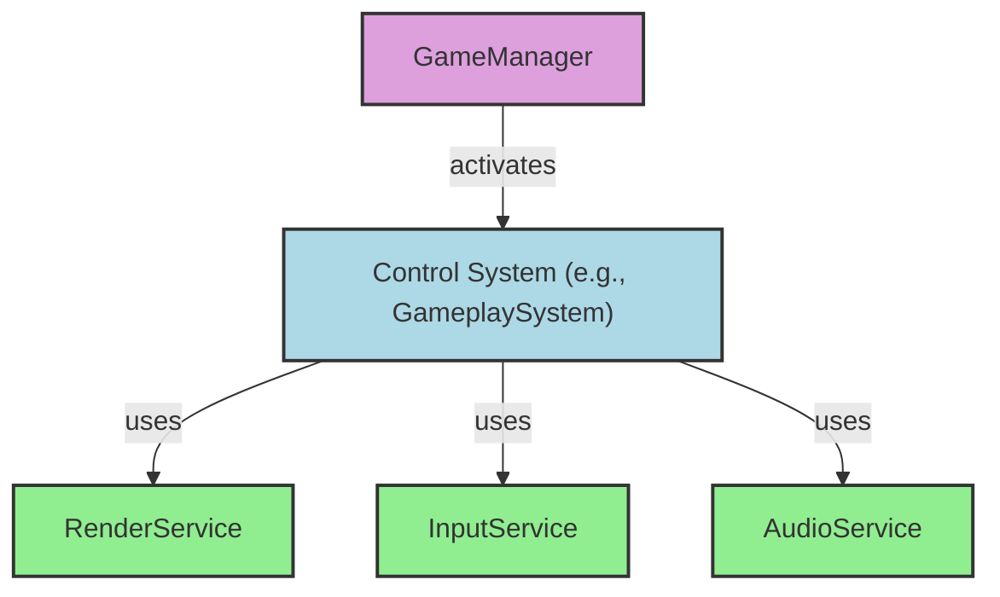
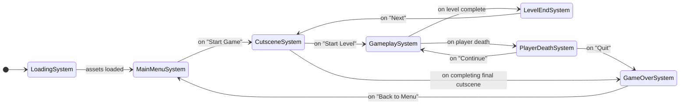

# L1 Architecture: Al Papone

This document outlines the high-level software architecture for the "Al Papone" game. It adheres to the principles defined in `L1_PrinciplesAndTech.md`, prioritizing modularity, clarity, and LLM-driven development.

## 1. Architectural Pattern: Manager-System-Service

The architecture is built on three core concepts: a central `GameManager`, state-specific `Control Systems`, and single-purpose `Services`.

*   **GameManager (The Orchestrator):** A single, always-active module that manages the main application loop and the overall game state. Its primary role is to activate and deactivate `Control Systems`. It acts as the central hub, ensuring only one system controls the game at any given time.

*   **Control Systems (The Brains):** These are state-specific modules, each responsible for managing a distinct phase of the game (e.g., `MainMenuSystem`, `GameplaySystem`). A `Control System` contains the logic for its state, orchestrates tasks, and decides when to transition to another state by requesting a change from the `GameManager`.

*   **Services (The Hands):** These are simple, independent modules that perform a single, well-defined task (e.g., `RenderService`, `AudioService`). They are stateless or have self-contained state and, crucially, **never communicate with other services**. They are tools used by the `Control Systems` to execute tasks.

This pattern creates a clear, one-way dependency flow:

## 2. Proposed Control Systems

To manage the game flow, we will need the following systems:

*   `LoadingSystem`: Manages the initial loading screen while fetching assets for the Main Menu. Transitions to the `MainMenuSystem`.
*   `MainMenuSystem`: Handles the main menu UI and user input. On "Start Game," it transitions to the `CutsceneSystem`.
*   `CutsceneSystem`: Displays the comic-style story scenes. It handles background asset loading for the upcoming level and manages user navigation ("Next," "Back"). It transitions to the `GameplaySystem` once loading is complete and the user proceeds. It is also used for transitions between levels and for the final game-ending sequence.
*   `GameplaySystem`: The core of the game. It runs the main game loop, managing player actions, enemy AI, physics, scoring, and all in-level events. Transitions to `LevelEndSystem` or `PlayerDeathSystem`.
*   `PlayerDeathSystem`: Activates when the player runs out of health. It displays a "You Lose" screen and provides the option to continue (transitioning back to `GameplaySystem` at a checkpoint) or quit (transitioning to `GameOverSystem`).
*   `LevelEndSystem`: Displays the end-of-level celebration screen. Transitions to the `CutsceneSystem` to show the story segment for the next level or the final outro.
*   `GameOverSystem`: Manages the end-of-game screen, including the leaderboard, score submission, and credits. Transitions back to the `MainMenuSystem`.

## 3. Proposed Services

Services are grouped by function. The `GameManager` would instantiate these and provide them to the active `Control System` as needed.

### Core Services
*   `RenderService`: Handles all drawing operations to the screen (sprites, UI, text).
*   `InputService`: Captures and provides access to keyboard and mouse/touch inputs.
*   `AudioService`: Manages playback for all background music and sound effects.
*   `AssetLoaderService`: Loads all game assets (images, audio, level data) and tracks their loading progress.

### Game-Logic Services
*   `PhysicsService`: Provides stateless collision detection functions.
*   `LevelManagerService`: Manages level progression, data, and sequencing (e.g., knows which level is next, what cutscene to show).
*   `PlayerStateService`: Manages player-specific data like lives, weapon state, ammo, and "Cherry Bomb" inventory.
*   `ScoringService`: Manages and stores the player's current score.
*   `LeaderboardService`: Handles fetching and saving high scores, likely using browser `localStorage` for the MVP.

## 4. System-Service Interactions

| System              | Services Used                                                                                                                              |
| :------------------ | :----------------------------------------------------------------------------------------------------------------------------------------- |
| **LoadingSystem**   | `RenderService`, `AssetLoaderService`                                                                                                      |
| **MainMenuSystem**  | `RenderService`, `InputService`, `AudioService`                                                                                            |
| **CutsceneSystem**  | `RenderService`, `InputService`, `AudioService`, `AssetLoaderService`, `LevelManagerService`                                                 |
| **GameplaySystem**  | `RenderService`, `InputService`, `AudioService`, `PhysicsService`, `LevelManagerService`, `PlayerStateService`, `ScoringService`             |
| **PlayerDeathSystem**| `RenderService`, `InputService`, `PlayerStateService`                                                                                      |
| **LevelEndSystem**  | `RenderService`, `InputService`, `ScoringService`, `PlayerStateService`                                                                    |
| **GameOverSystem**  | `RenderService`, `InputService`, `ScoringService`, `LeaderboardService`                                                                    |

## 5. State Flow Diagram

The transitions between `Control Systems` are managed by the `GameManager` and follow this logical flow:

