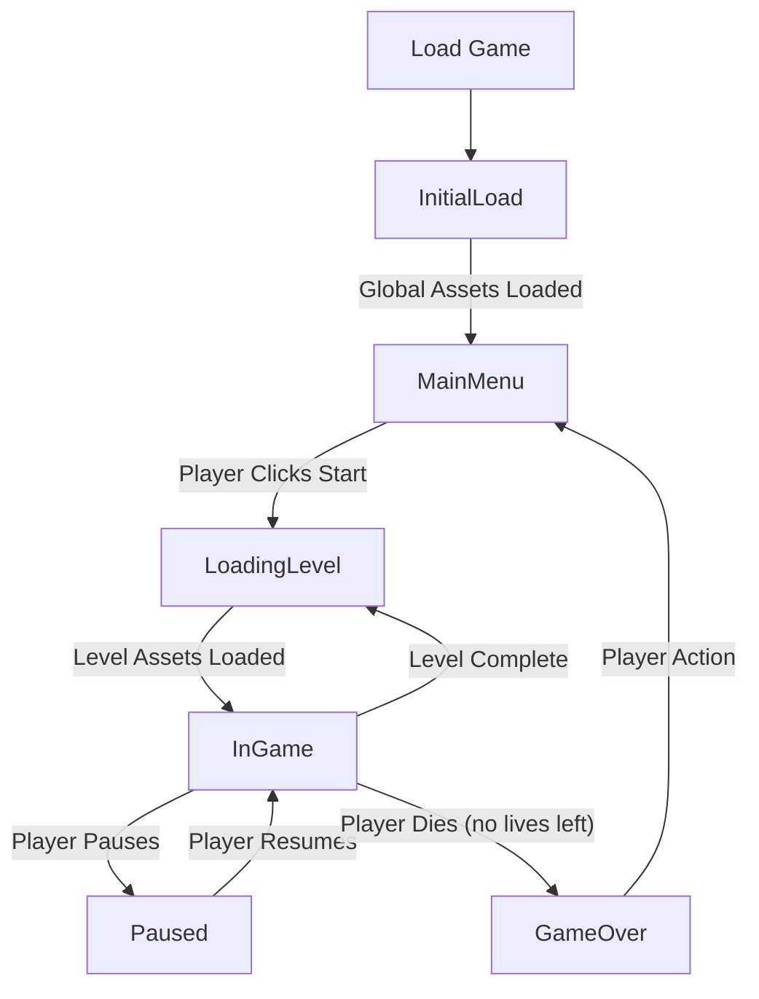

### L1 High-Level Flow: The "Central Conductor" Model

This document outlines the high-level application flow and the core modules that structure the game.

#### 1. High-Level Flow

The game's architecture is built on a "Central Conductor" pattern. This pattern uses a single `GameManager` module to control the main application state and orchestrate all other independent systems. This design ensures a flat hierarchy and a single source of truth for the game's overall state, aligning with our principles of modularity and clarity.

##### 1.1. Application State Diagram

The `GameManager` transitions between the following states to control the application flow:

##### 1.2. The Player's Journey

From the user's perspective, the flow is as follows:
1.  The game performs an **Initial Load** for global assets before displaying the **Main Menu**.
2.  The player initiates the game, triggering a **Loading Level** state where level-specific assets are prepared.
3.  The game transitions to the **In-Game** state, where the core gameplay loop runs.
4.  If a level is completed, the game returns to the **Loading Level** state to prepare the next level.
5.  If the player runs out of lives, the game enters a **Game Over** state, from which they can return to the Main Menu.

#### 2. Core Modules & Communication

The architecture consists of several independent modules orchestrated by the `GameManager`.

##### 2.1. Module Communication Contract

Modules are "passive" and do not communicate directly with each other. They signal their status back to the `GameManager` via a consistent contract: each module's `update()` function must return a status object. This ensures all communication is explicit and reliable.

##### 2.2. Module Responsibilities

*   **`GameManager`**: The Conductor. Manages the main game state (`MainMenu`, `InGame`, etc.) and the primary game loop. Orchestrates all other modules based on the returned status objects.
*   **`AssetManager`**: The Quartermaster. Manages a two-stage loading process: an initial load for global assets (e.g., player sprite, UI elements) and on-demand loading for level-specific assets requested by the `LevelManager`.
*   **`MenuSystem`**: The Lobby. Manages the logic, rendering, and user input for all non-gameplay screens, such as the Main Menu, Options, and Leaderboard.
*   **`LevelManager`**: The Stagehand. Requests raw level data from the `AssetManager` and assembles it into a level-specific "script" object containing all logic and data for that level (e.g., enemy spawn patterns, event triggers).
*   **`GameplaySystem`**: The Engine. A generic system that executes the core gameplay loop. It consumes the "script" object provided by the `LevelManager` to run the specific rules of the current level, keeping it decoupled from any level-specific design.
*   **`UISystem`**: The HUD. Renders the in-game Heads-Up Display, showing real-time information like score, lives, and ammunition.
